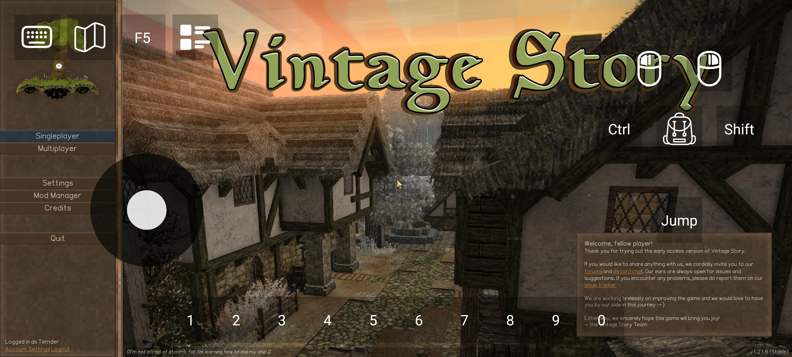

# Info

All credit goes to the original creator of this project (https://github.com/VSMobile/dnbootstrap). I added to this with AI so I could create a better controlling system for my liking.

What is added:
- joystick, configurable background color and icon
- mod importing by selecting "open with" on a zip file in a file manager (not all mods work)
- minecraft mobile like touch controls (short touch = right mouse click, long touch holding = left mouse holding)

